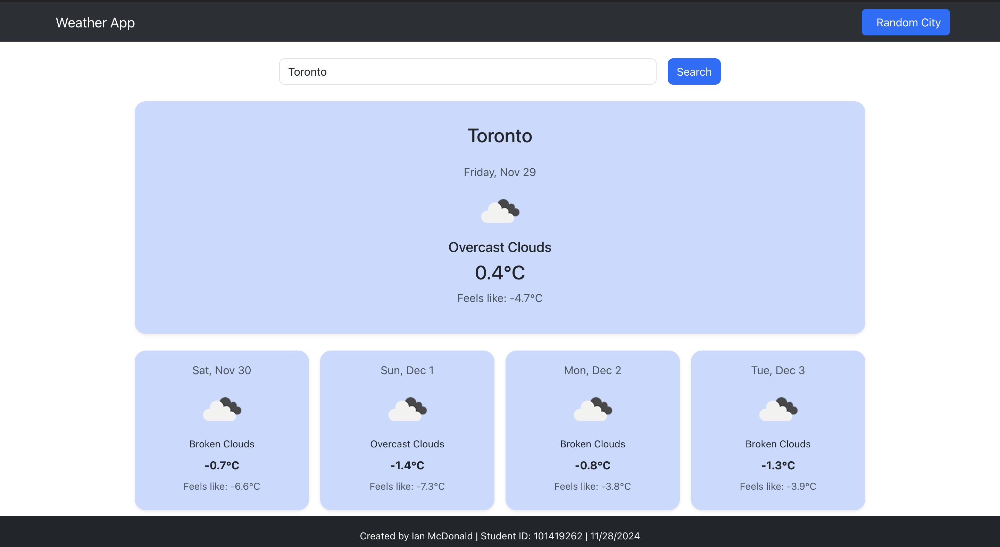
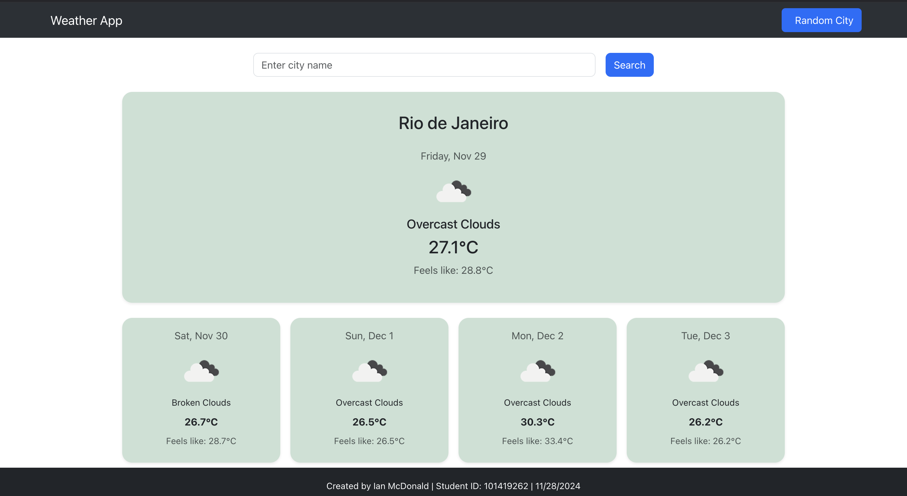
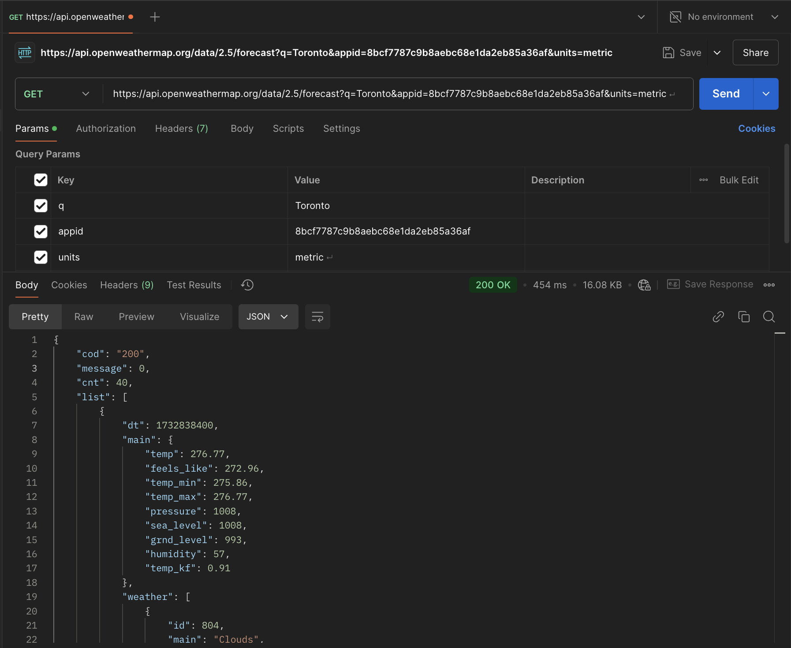

# Weather Forecast Application

A React-based weather forecast application that provides current and future weather information for cities worldwide.

## Features

- Real-time weather data from OpenWeatherMap API
- Search for weather by city name
- Display a random cities weather with the random button
- Display multiple days of weather forecasts
- Random city weather generator
- Responsive design that works on desktop and mobile devices
- Dynamic background colors based on temperature
- Detailed weather metrics:
  - Temperature
  - "Feels like" temperature
  - Humidity levels
  - Wind speed
  - Weather conditions icons

## Technologies Used

- React.js
- React Bootstrap for UI components
- OpenWeatherMap API for weather data
- React Icons for weather icons
- Bootstrap for styling

## Installation

1. Clone the repository:
```bash
git clone https://github.com/IanM21/101419262_comp3123_labtest2.git
```

2. Install Dependencies
```bash
cd 101419262_comp3123_labtest2
npm install
```

3. Create a .env file and add your 
[OpenWeatherMap](https://openweathermap.org/) API key:
```bash
REACT_APP_WEATHER_API_KEY=your_api_key_here
```


4. Start React App:
```bash
npm start
```

## Screenshots
### Main Weather Display


### Random City Forecast


### POSTMAN Tests
